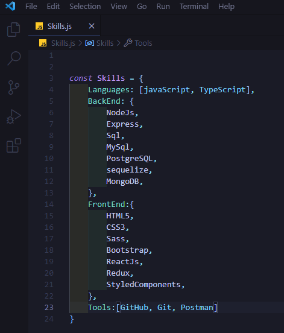
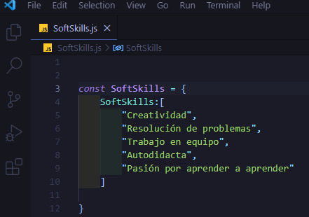

### Hi there 👋

### 
My name is Guillermo Agustín Borquez and I'm Full Stack Developer 🚀
  

  

- 🔭 At this moment I am expanding my experience and skills to get my first job in the world of programming.  
  

- 🌱 I’m currently learning Typescript and MongoDB.  
  

- 🧠 I'm currently interested on start working in the industry.  
  

- ✉️ How to reach me  on Email at [Agustín Borquez](mailto:agustinborquez1999@hotmail.com)  
  
 

<h2>My Skills</h2>

   
 <h2>My Soft-Skills</h2>

   

## Connect with me  

  

  
  
  
 <h2>Github Stats</h2> 

 
